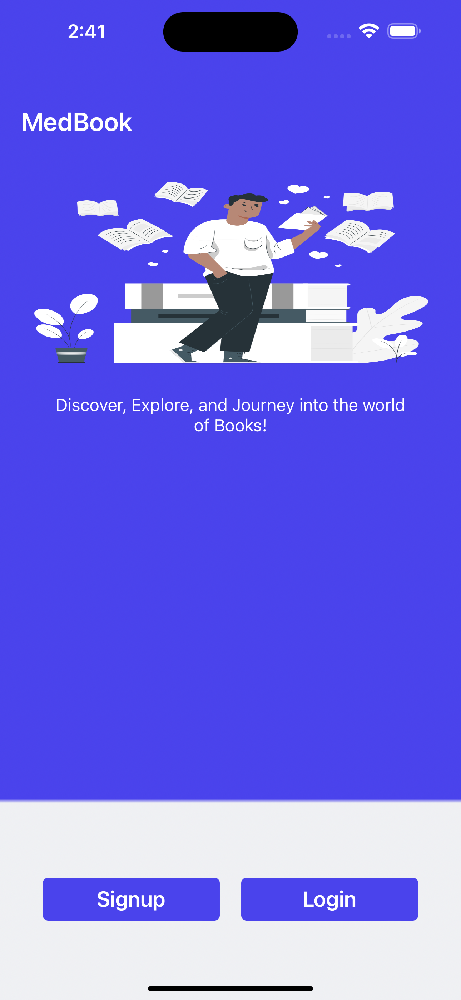
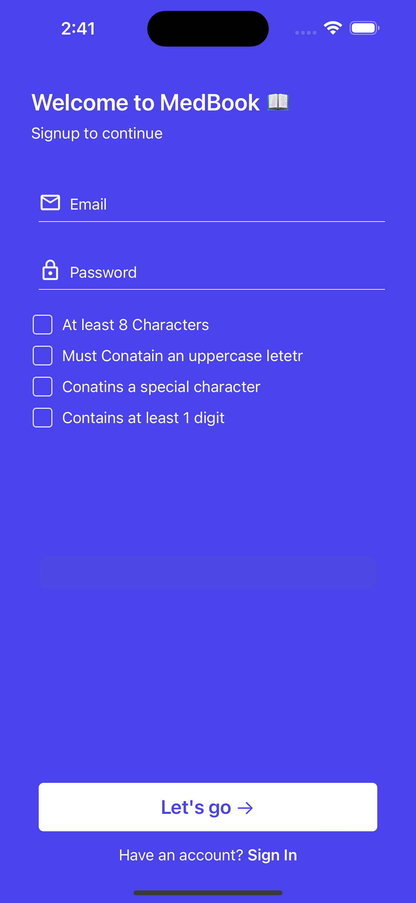
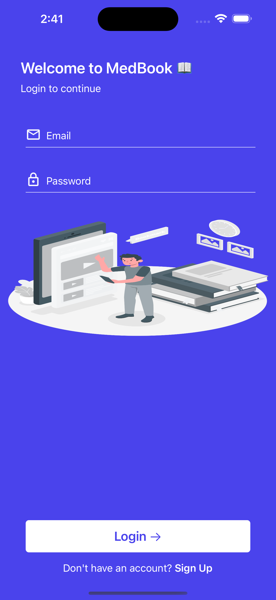
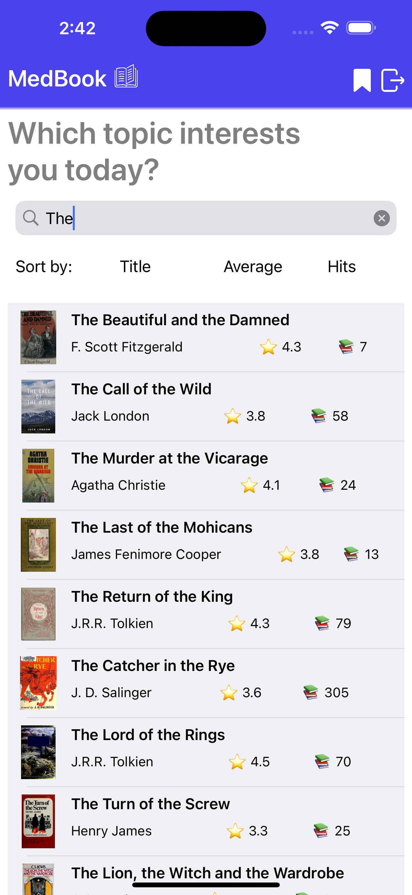
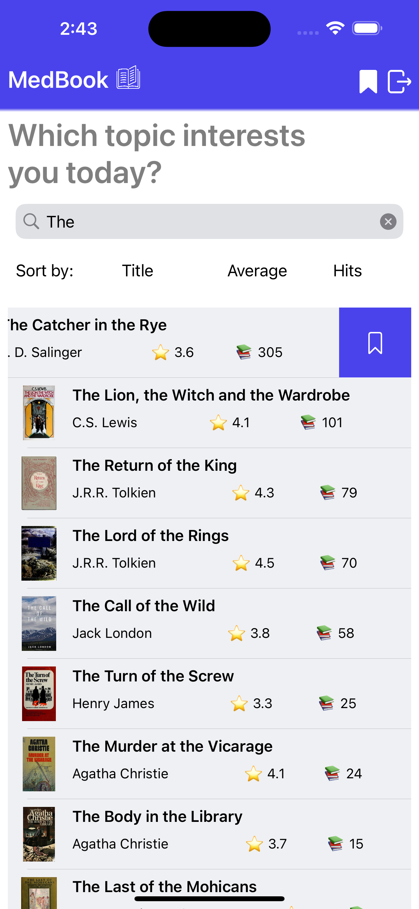
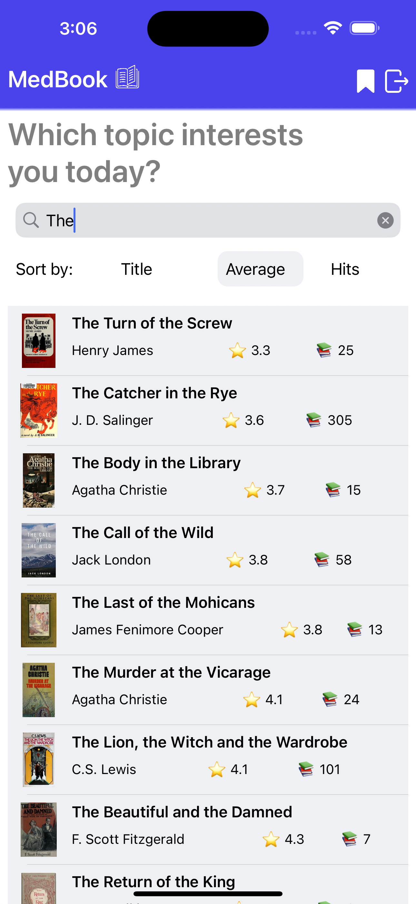
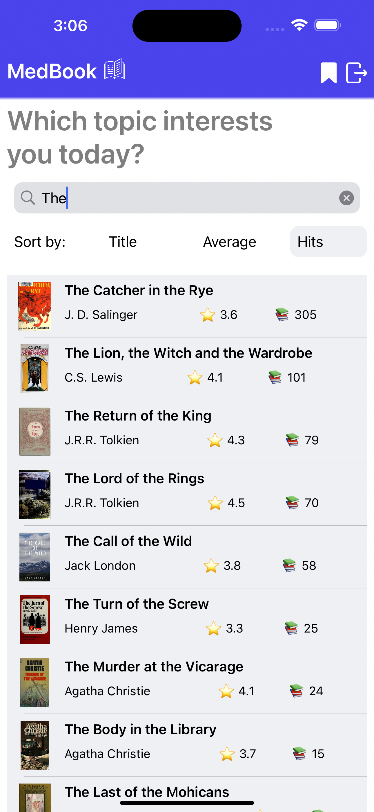
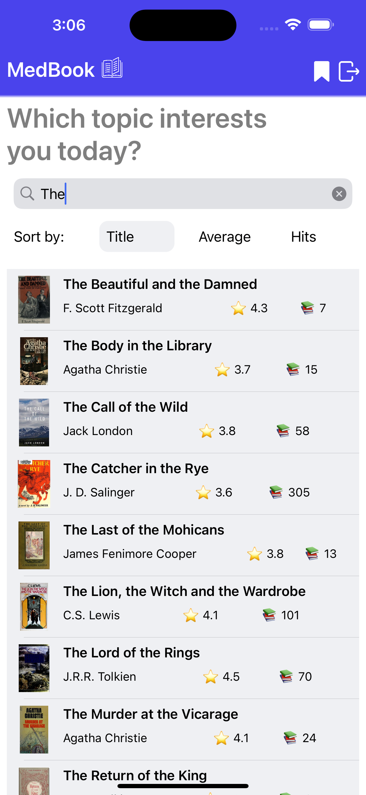

# MedBook - iOS/iPadOS App

MedBook is an iOS/iPadOS application designed to streamline the process of searching for books, sorting them, and bookmarking for later use.

## Features

### Authentication
- Users can choose between Signup and Login options.
- Email validation ensures only valid emails are accepted.
- Password validation ensures minimum security standards are met.
- User information is stored locally in the database upon successful signup.

### Default Country Selection
- Utilizes IP-based country detection to set the default country in the signup process.
- Default country information is stored in User-Defaults for future signups.

### Book Searching
- Users can search for books using a Search Bar on the Home Screen.
- Fetches book results from an API when 3 or more characters are entered.
- Sorting options available: Sort by Title, Average Rating, and Hits.
- Results are displayed in a TableView with smooth pagination.
- Pagination is implemented to load more search results as the user scrolls down.

### Bookmarking
- Users can bookmark books and view them in a separate Bookmarked Screen.
- Modification to the Home Screen Results TableView Cell includes a Bookmark Button.
- Bookmarked books are stored locally in the database for persistence.

## Dependencies
- Realmswift

### Installation
To install the dependencies, run the following command in the project directory:
```bash
pod install
```
## Architecture
- MVVM + Coordinator + Assembly
- Utilizes SOLID principles for robustness and scalability.

## Screenshots
<a href="images/1.png"></a>
<a href="images/2.png"></a>
<a href="images/3.png"></a>
<a href="images/4.png"></a>
<a href="images/5.png"></a>
<a href="images/6.png"></a>
<a href="images/7.png"></a>
<a href="images/8.png"></a>
<a href="images/9.png"></a>

## Usage
To run the app, simply clone the repository and open it in Xcode.

## License
This project is licensed under the [MIT License](LICENSE).

## Facing Any Problem or need any Help
Write me in [issues](https://github.com/geekyamitesh/MedBookApp-iOSApp/issues) section. I will try solve your issue within 10-12 hours.
</br>***Keep Developing and Destroying.*** :wink:

<p align="center">
  <i>Take a look at my repositories and let's get in touch!</i>

<p align="center">
<a href= "https://github.com/geekyamitesh"></a>
<a href= "https://www.linkedin.com/in/geekyamitesh/"></a>
<a href= "https://twitter.com/geekyamitesh03"></a>
<a href= "https://geekyamitesh.github.io/amitesh/"></a>
</p>

</p>
